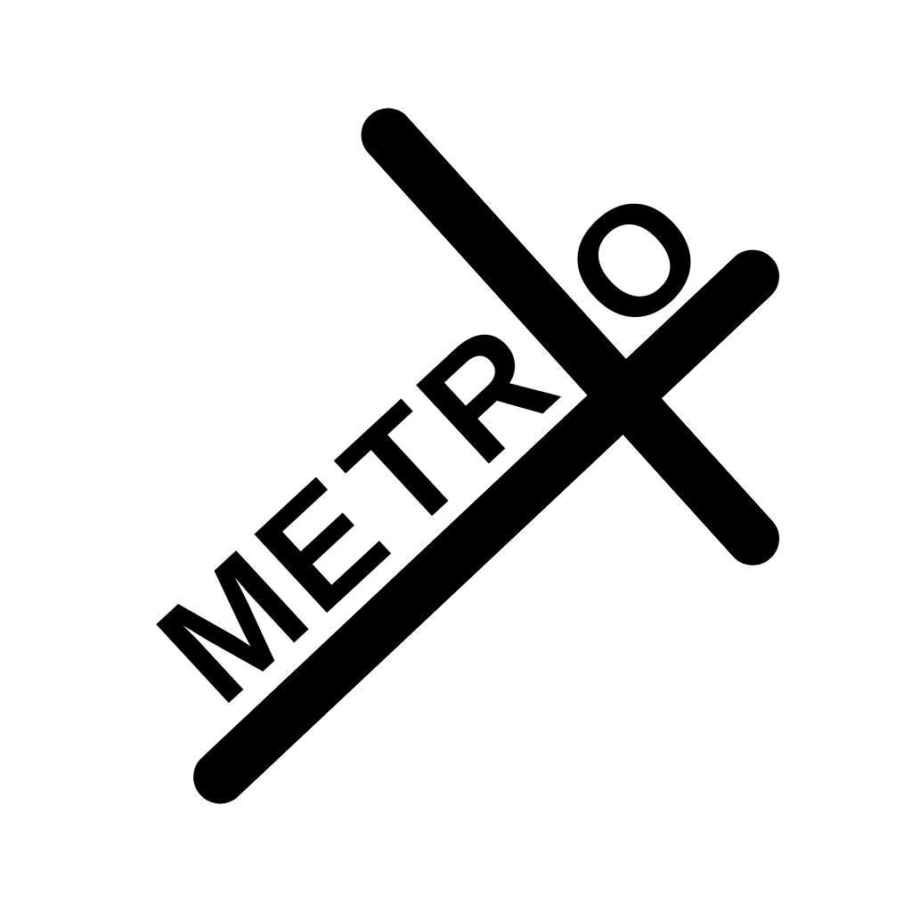
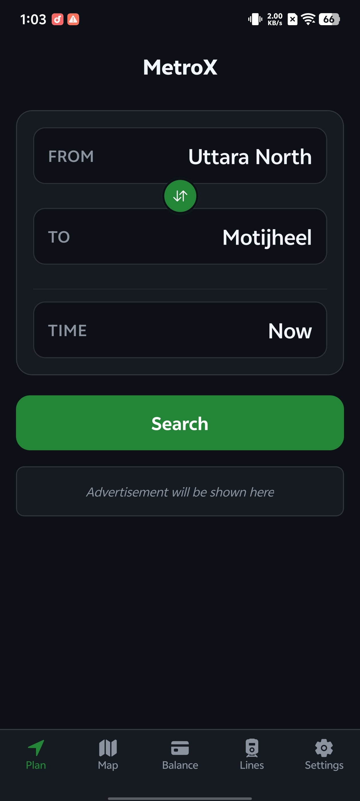
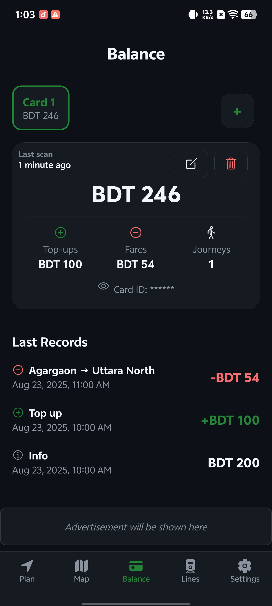
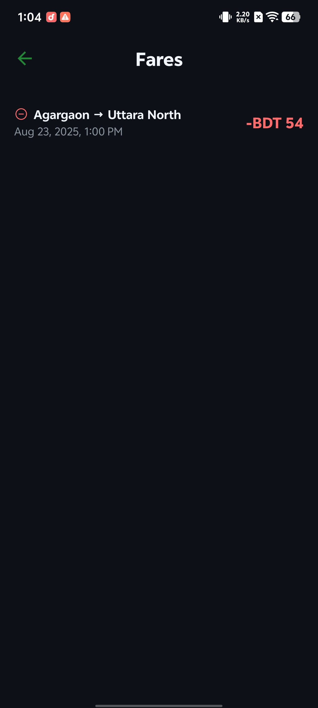
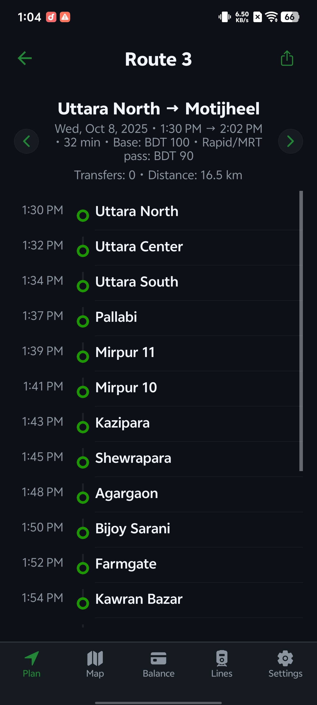
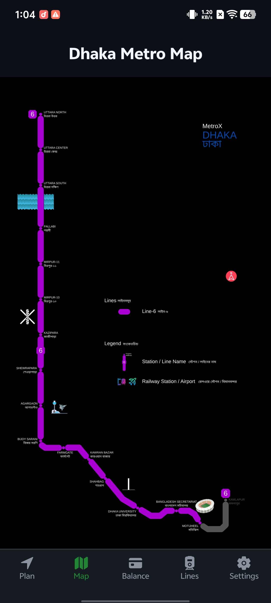
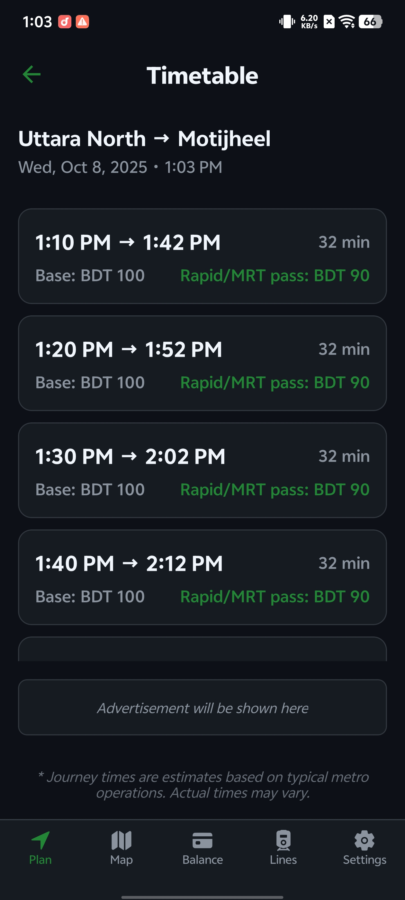
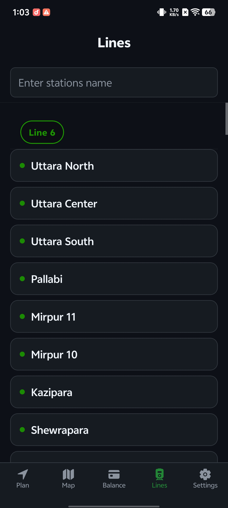
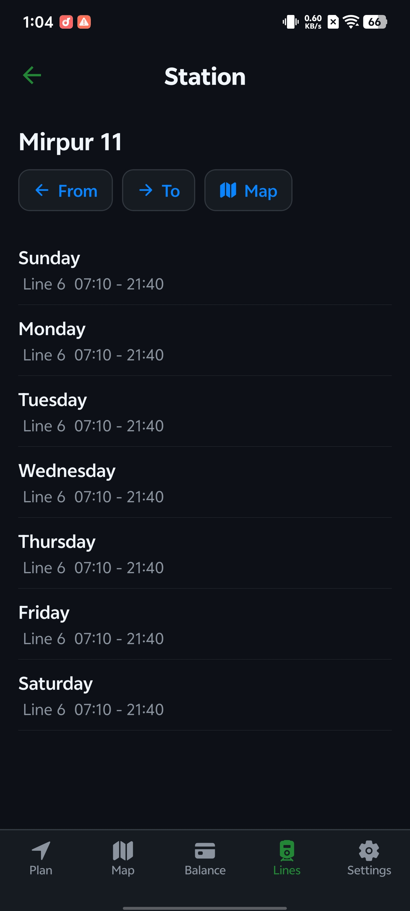
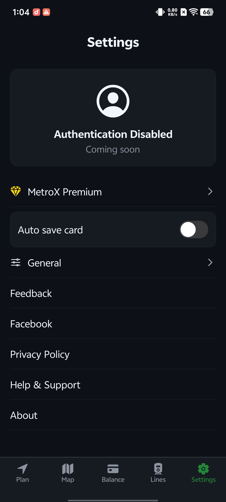

# MetroX - Dhaka Metro Rail App 🚇

  
  <!-- Add your app logo/icon here -->
  
  
  ### Your Smart Companion for Dhaka Metro Rail
  
  
  
  
  

---

## 📱 About MetroX

MetroX is a comprehensive mobile application designed for commuters of the Dhaka Metro Rail (MRT) and Rapid Pass users in Bangladesh. The app provides essential features to make your daily commute smoother and more convenient.

## ✨ Key Features

### 🎫 NFC Card Balance Reading
- **Instant Balance Check**: Scan your Rapid Pass or MRT card to view your current balance
- **Transaction History**: View your recent travel transactions with dates and stations
- **Real-time Data**: Get accurate information directly from your NFC card

### 🗺️ Interactive Metro Map
- **Full Network View**: Explore the complete Dhaka Metro Rail network
- **Station Details**: Get information about each metro station
- **Route Planning**: Plan your journey between stations

### 🚉 Route & Fare Calculator
- **Smart Route Finding**: Find the best route between any two stations
- **Fare Calculator**: Calculate exact fare before your journey
- **Travel Time Estimates**: Know how long your trip will take

### 📊 Metro Lines Information
- **Line Details**: View information about all metro lines
- **Station Lists**: Browse all stations on each line
- **Service Updates**: Stay informed about line status

### ⚙️ Additional Features
- **Dark/Light Theme**: Choose your preferred visual theme
- **Multi-language Support**: Available in English and Bangla
- **Offline Access**: View maps and calculate fares without internet
- **Fast & Lightweight**: Optimized for smooth performance

---

## 📸 Screenshots

### Home Screen & Balance Check
  

### Route Planning & Metro Map
  

### Lines & Settings
  

---

## 📥 Download

### Latest Release

**Version 1.0.0** - [Download APK](https://github.com/fahim2443/metrox-app/releases/download/v1.0.0/metrox-v1.0.0.apk)

> **Note**: Enable "Install from Unknown Sources" in your Android settings to install the APK.

### System Requirements
- Android 8.0 (Oreo) or higher
- NFC capability (for card balance reading feature)
- ~20 MB storage space

---

## 🚀 How to Use

### Reading Your Card Balance
1. Open the MetroX app
2. Tap on the "Balance" tab
3. Hold your Rapid Pass or MRT card to the back of your phone
4. View your balance and transaction history instantly

### Planning Your Route
1. Go to the "Home" tab
2. Select your starting and destination stations
3. View the route, fare, and estimated time
4. Start your journey!

### Viewing Metro Map
1. Navigate to the "Map" tab
2. Explore the interactive metro map
3. Tap on stations for more details

---

## 🛠️ Technology Stack

- **Framework**: React Native with Expo
- **Platform**: Android
- **NFC**: FeliCa card reading technology
- **Maps**: Interactive SVG-based metro map
- **UI**: Modern Material Design principles

---

## 🎯 Supported Cards

- ✅ Dhaka MRT Rapid Pass
- ✅ Metro Rail Travel Cards
- ✅ All FeliCa-based transit cards used in Bangladesh

---

## 📝 Changelog

### Version 1.0.0 (Current)
- ✨ Initial release
- ✅ NFC card balance reading
- ✅ Transaction history display
- ✅ Interactive metro map
- ✅ Route and fare calculator
- ✅ Multi-language support (English/Bangla)
- ✅ Dark/Light theme support
- ✅ Offline functionality

---

## 🐛 Known Issues & Roadmap

### Known Issues
- None reported yet

### Upcoming Features
- 🔔 Push notifications for metro updates
- 📍 Nearest station finder using GPS
- 💳 In-app card recharge information
- 🎫 Digital ticket booking (future)
- 📊 Travel statistics and insights

---

## 🤝 Feedback & Support

We'd love to hear from you!

- **Bug Reports**: [Open an Issue](https://github.com/fahim2443/metrox-app/issues)
- **Feature Requests**: [Request a Feature](https://github.com/fahim2443/metrox-app/issues/new)
- **Email**: fahim2443@gmail.com

---

## 📄 License

This project is licensed under the MIT License - see the [LICENSE](LICENSE) file for details.

---

## 👨‍💻 Developer

**MD Shoriful Islam Fahim**

- GitHub: [@fahim2443](https://github.com/fahim2443)
- Email: fahim2443@gmail.com

---

## ⭐ Show Your Support

If you find MetroX helpful, please consider giving it a star ⭐ on GitHub!

---

## 📱 Follow Development

Stay updated with the latest features and releases:

- ⭐ Star this repository
- 👀 Watch for updates
- 🍴 Fork to contribute

---

  
  **Made with ❤️ for Dhaka Metro Rail Commuters**
  
  © 2025 MetroX. All rights reserved.
  

